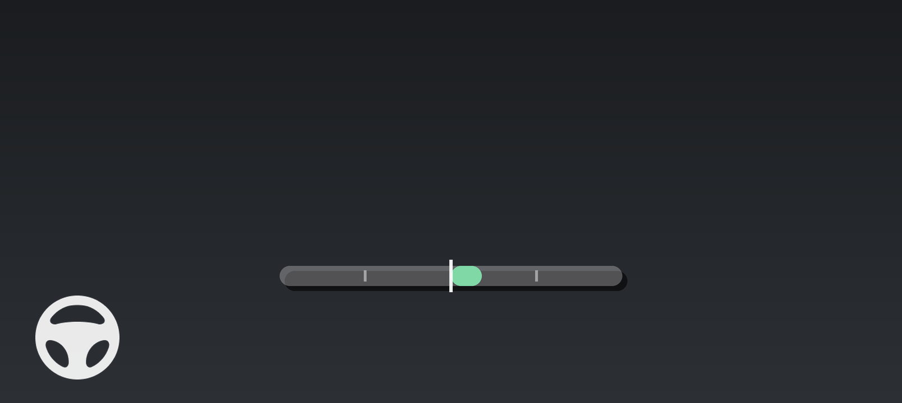

# Lane Centering

Lane Centering keeps the car in the middle of the two painted lines, instead of letting it settle wherever the driving model happens to put it. It is a small, continuous trim on top of normal steering, not a separate steering mode, and it is eased in and out rather than switched on and off. Done properly you should not be able to feel it working - the car simply sits straighter in its lane.

**Where it has landed:** the `geo-lane-a` test branch, moving onto the `dev` and `dev-a` development trunks now. It is not in any prebuilt yet. It works on any car, but everything measured so far was measured on a Rivian R1S. It is **off by default**.

## Why it exists

The driving model steers along a path it picks for itself. That path is usually close to the middle of the lane but not on it, and the error is not random - the car sits consistently to one side, all day, on the same roads.

How far off depends almost entirely on **which driving model you are running**, which is the part most people do not expect:

| Driving model, feature off | Where the car actually sat |
| :---- | :---- |
| Down to Ride v6 | 13.9 cm right of center, on average |
| GWM V9 | 1.0 cm left of center, on average |

With Lane Centering on, both models sat within about 3 to 5 cm of the middle. On a 13 minute drive with the same model and roads either way:

| Speed | Average distance off center, off | on |
| :---- | :---- | :---- |
| 11-34 mph / 18-54 km/h | 13.5 cm right | 3.3 cm right |
| 34-56 mph / 54-90 km/h | 20.3 cm right | 5.8 cm right |

The car spent 78% of that drive more than 10 cm off center without it, and 42% with it.

So the feature matters a great deal on some driving models and very little on others, and you cannot tell which from the driver's seat without measuring. That is worth knowing before you decide whether it did anything for you.

## What it actually does

A hundred times a second it looks about one second of travel ahead, works out where the middle of the painted lane is at that point and where the car is going to be, and if the two differ by more than the tolerance it adds a very small steering nudge toward the middle, easing it in over about half a second.

**The nudge is tiny.** Across a full drive the sideways push it added averaged about 0.03 meters per second squared and never went past 0.09. A gentle highway curve is more than ten times stronger than that. At the wheel it is about one degree at road speed. There is a hard cap it can never exceed, and it is applied *before* the existing steering rate and cornering limits, so it cannot ask the car for anything it would not otherwise have been allowed to do.

## Turning it on

1. Open **Settings > sunnypilot > Steering**.
2. Turn on **Lane Centering**.
3. The four adjustments live behind **Customize Lane Centering**, which becomes available once the feature is on.

The same settings appear in Sunnylink under **Steering**, in their own **Lane Centering** section, with the adjustments in a **Lane Centering Settings** sub-panel.

Everything here can be changed while driving. The change takes effect within about three seconds, and because the correction fades in and out, switching it on or off mid-drive is smooth - which makes it easy to compare on against off in a single drive.

> **After a fresh install, reboot the device before looking for these.** Two new settings had to be registered, and that only happens on a restart. Until then the menu items are not there at all.

> **If you are updating rather than installing fresh, check the two numbers by hand.** New defaults only apply to a fresh install. An existing device keeps whatever it had, so **Centering Strength** may still be sitting at the old 30% and **Close Enough To Center** at the old 4 cm. Set them to **60%** and **2 cm**.

## What you see on screen

Turning on **Show Correction On Screen** (the last item in the same menu) puts a small readout just below the speed. It is off by default. It answers one question at a glance: which way is lane centering nudging the car right now, and how hard.

There are three things to read:

- **The bar** fills out of the mark in the middle, towards the side the car is being pulled. Further out means working harder.
- **The number on the left** is the size of the nudge, as a sideways push in meters per second squared - the same unit the Developer UI uses for cornering force. The arrow beside it is the direction.
- **The number on the right** is how far off the middle of the lane the car is sitting, with an **L** or an **R** for the side it is off to. `3L in` means three inches left of center. In the picture above the car is three inches left of the middle and is being nudged gently right, which is exactly what it should be doing.

Those two numbers are the only colored text. Units and words beside them are plain white, so the color never has to compete with anything.

**The numbers settle twice a second**, not every frame. Each figure stands for half a second and is then replaced by the average of the half second just gone, because a number redrawn twenty times a second cannot be read at all. So what you see is what the car has been doing, not one instant of it. The bar underneath still moves continuously, which is what makes a brief loss of the lane lines show up as a flash of gray.

Distances are shown in inches or centimeters according to your units setting - the same one that picks mph or km/h.

### What the colors mean

**Green - correcting normally.** The ordinary state on a marked road.

**White "centered" - deliberately doing nothing.** The car is already within the tolerance of where it is aiming, so the feature stands down. `on center` on the right means less than half a unit off. At the 2 cm default you will see this less than you did at the old 4 cm.

**Gray "no lines" - not acting at all.** The lane lines cannot be trusted, so nothing is being applied and no distance is shown. This is also what you get during a lane change and while a turn signal is on. Seeing this flash through a bend or across an intersection is normal.

**Amber - working harder than usual.** Past the end of the bar. Usually means the car has wandered a long way off center and is on its way back.

**Red - it wanted more than it is allowed.** The correction has been cut back to the cap. In practice this only happens at low speed.

### On a comma 4

There is no room for the numbers on a comma 4 screen, so you get the bar on its own, in the lower middle. Direction and effort read exactly the same way, and it uses the same colors.

### When to leave it on

It is genuinely useful when you are comparing settings, or want to know whether the feature is doing anything on a particular road. It is clutter the rest of the time. Leave it off unless you are looking at something.

## The settings

### Position in Lane

Sit deliberately off the middle of the lane, up to 30 cm (about 12 inches) either way. Shown in words on the device, for example "12 cm right", so there is no sign to remember. In Sunnylink it is in meters, where positive is to the right.

Whatever you ask for, the car is never aimed closer than **1.1 m / 3.6 ft** to either line. In a narrow lane a large offset is quietly trimmed back to respect that, so you cannot use this to ride the line.

The usual reason to touch it is that the car ends up consistently off center in one direction even with the feature on - dial in a small value the other way.

### Let the Model Sit Off Center

Sometimes the driving model moves well off the middle on purpose, usually because it is avoiding something. This decides who wins. It only applies to **large** departures; small ones are always corrected whatever this is set to.

| Setting | What happens |
| :---- | :---- |
| **Model decides (100%)** | The model gets its way when it is confident and well off center. The default. |
| **50%** | Split the difference - the car comes part of the way back. |
| **Always center (0%)** | The car is centered regardless of what the model wanted. |

Leave it at the default unless you find the car declining to center itself where you think it should. Turning it down makes the feature more insistent, which also means overriding the model in situations where the model may have had a good reason.

### Centering Strength

How hard the car is pulled back toward the middle. **The default is 60%**, and that is where it should stay unless you are deliberately running a comparison.

Earlier builds defaulted to 30%, which turned out to be too weak: at that setting the feature only ever acted on about a fifth of the error it could see, and the car settled about 6 cm off the middle rather than on it. Six drives across two driving models settled on 60%. Below it the car sits further off the middle; above it the car starts crossing to the far side and wandering, which is what overcorrecting looks like both on the numbers and from the seat.

If you do compare, be warned that **30% feels smoother than it is**. It applies about a third of the sideways force of 90%, which is below what a driver notices, so a loop that is barely acting reads as a calm one - and it is also the setting that leaves the car furthest off the middle. Judge it on where the car ends up sitting, not on how little you can feel it.

### Close Enough To Center

Lane centering ignores the car being slightly off the middle, because chasing the last millimeter would make the steering fidget for no benefit. This sets that tolerance, and inside it the feature does nothing at all. Range 0 to 15 cm, **default 2 cm**.

| Tolerance | Typical distance off center | Time spent more than 10 cm off |
| :---- | :---- | :---- |
| 0 cm | 4.3 cm | 9% |
| **2 cm** | **5.6 cm** | **13%** |
| 4 cm | 6.1 cm | 19% |
| 8 cm | 8.4 cm | 32% |

**A wide tolerance does not make the car calmer.** This is the part worth knowing, because it is the opposite of what the word sounds like it should mean. A wide band lets the car drift out to the edge, get a kick back, drift to the other edge, and get kicked again. Over the same road, 8 cm reversed the direction of the correction about twice as often as 0 cm did. Correcting continuously turns out to be the smoother behavior, not the busier one.

So why 2 cm rather than 0? Neither reason is in the table. At 0 there is no holding state at all, so the readout never says "centered" and always shows a figure, which is a busier thing to have on screen all day. And 0 leaves no margin for a car whose camera calibration is slightly off. 2 cm keeps almost all of the benefit and keeps both of those.

If you have the readout turned on, this control is directly visible: the white "centered" state is the car sitting inside the tolerance. Lower the tolerance and you will see that state less often.

### Show Correction On Screen

Covered above - see [What you see on screen](#what-you-see-on-screen).

## When it acts, and when it stands aside

It only acts when it is confident. All of the following have to be true:

- Both lane lines are clearly seen, and the model is sure where they are.
- The gap between them is a believable lane width (2.6 m to 4.8 m), which rules out merges, splits and junk detections.
- You are above about **11 mph / 18 km/h**.
- Lateral control (MADS, or normal engagement) is on.
- No lane change is running.
- No turn signal is on.

When any of that stops being true the nudge **fades away over about a fifth of a second** rather than being dropped in one go, so there is no step in the steering. On screen that is the gray "no lines" state.

## What further testing would help

Everything measured so far is **one car, two driving models and a small number of roads**. The two numbers are adjustable at the side of the road precisely so that other people can find out what suits their car, and both are worth a deliberate drive rather than a guess. The useful shape for all of these is the same: pick one stretch of road, drive it more than once, change one thing between legs, and leave everything else alone.

| Setting | What is worth trying | What to look for |
| :---- | :---- | :---- |
| **Centering Strength** | 40, 60 and 80% back to back on the same road | Where the car settles left to right, and whether it starts crossing to the far side. 60% is right for a Rivian R1S; a lighter or slower-steering car may want more or less |
| **Close Enough To Center** | 0 and 2 cm on the same road | Whether 0 is worth the readout never saying "centered". If your camera calibration is slightly off, 0 may hunt where 2 does not |
| **Position in Lane** | A small value against a car that sits off center with the feature on | Whether the residual bias goes away, and whether it stays gone on a different road |
| **Let the Model Sit Off Center** | 50% if the car declines to center where you think it should | Whether it now centers in those places, and whether it starts arguing with the model somewhere it was right |
| **Driving model** | The same drive on two models with the feature off | Your own starting point. A model that already sits centered has very little for this feature to do |

Roads and conditions worth pointing it at:

- **Narrow lanes**, where the 1.1 m minimum distance to a line starts trimming what it will do.
- **Poor or repainted markings**, tar snakes, and old lines left beside new ones.
- **Road work, merges, splits and wide intersections**, where the lines briefly become unreliable. It should quietly stand down, not lurch. The gray "no lines" state is what you are looking for.
- **Low speed**, below about 25 mph, which is where the red capped state actually shows up.
- **Long constant-radius bends**, where any bias in how the model reads the lines shows most clearly.
- **A strong road crown**, which is the thing 30% was too weak to hold against.

What is worth writing down when you report back:

1. Which driving model you were on, and the two settings you used.
2. The route or the time of day, so the drive can be found in the logs.
3. Whether you could feel it working, and where.
4. Where the car looked to be sitting **by eye**. This one matters more than it sounds: the logs cannot tell the difference between the car genuinely sitting 6 cm right of center and the camera reading the painted lines 6 cm to the right of where they really are, because the feature and the measurement both come from the same picture. Your eyes can. If the car looks centered to you, the remaining 6 cm is only in the numbers.

## How this differs from Adjust Camera Offset

There is an existing setting, **Adjust Camera Offset** (Settings > sunnypilot > Models), that also moves the car sideways in its lane. They are not the same thing.

| | Lane Centering and its Position in Lane | Adjust Camera Offset |
| :---- | :---- | :---- |
| **What it changes** | Where the car aims, relative to the painted lines it can see | Where the car believes the camera is, which shifts its whole view of the world |
| **Acts when** | Only when both lines are clearly visible | Always |
| **Effect on the on-screen path** | None, the display is unchanged | Shifts the drawn path and lane lines too |
| **Good for** | A car that sits off center in a marked lane | A genuinely mis-positioned or mis-calibrated camera |

Using both at once means two settings fighting over the same thing. Pick one. If the car sits off center in normal marked lanes, Lane Centering is the one you want, and the camera offset should stay at zero.

## Things to keep in mind

- This assists you. It does not replace attention, and it does not keep the car in its lane on its own.
- It does nothing at all where there are no clear lines - unmarked roads, road work, snow, faded paint, wide intersections. That is deliberate, and in those places the car steers exactly as it did before.
- It aims at the middle of the lines **the camera can see**. If the markings themselves are off, or one line is a curb edge the model has read as a line, the middle it works out will be off with them.
- If turning it on visibly moves the car off center the *other* way, that is the lane-line reading being slightly biased rather than the feature misbehaving. Trim it out with **Position in Lane**.
- It works the same whether the car is steering with torque or with the angle harness, because it acts before either takes over.

## If something is not working

- **There is no Lane Centering item in the Steering menu.** The update has not finished installing, or the device has not been restarted since it did. Check **Settings > Software**, then reboot - this needs a full restart, not just new files.
- **Customize Lane Centering does nothing.** The main **Lane Centering** toggle is off. The adjustments only become available once the feature itself is on.
- **It does not seem to be doing anything.** Turn on **Show Correction On Screen** and look. Gray "no lines" all the time means the lane markings are not good enough where you are driving. White "centered" all the time means it is working and there is nothing to correct. If it says neither, check **Centering Strength** is not sitting at 0.
- **It was better before the update.** Check the two numbers. An update keeps whatever your device already had, so a device that has been through several builds may still be on 30% strength and a 4 cm tolerance.
- **The car now sits off center the other way.** Expected on some roads and some models - the lane-line reading is slightly biased. Dial a small **Position in Lane** value the opposite way and see whether it holds on a different road too.
- **The readout flickers between states.** It should not - the text settles twice a second on purpose. Rapid flicker of the *bar* is normal and is the lane lines dropping in and out for a few frames at a time.
- **I can feel it working.** That is worth reporting. Note the road, the speed and both settings. Try 40% before you conclude the feature is at fault, since strength is the most likely cause.
- **It fights me when I take the wheel.** It should not - it stands down with the rest of lateral control. Report this one with the time and route.

## Related pages

- [Curve Speed Control](curve-speed-control.md) - the longitudinal equivalent, slowing for curves rather than positioning within the lane.
- [Rivian MADS](rivian-mads.md) - how lateral control gets engaged in the first place.
