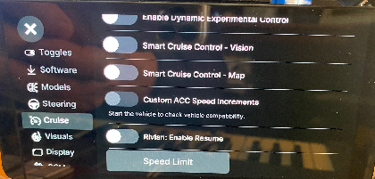
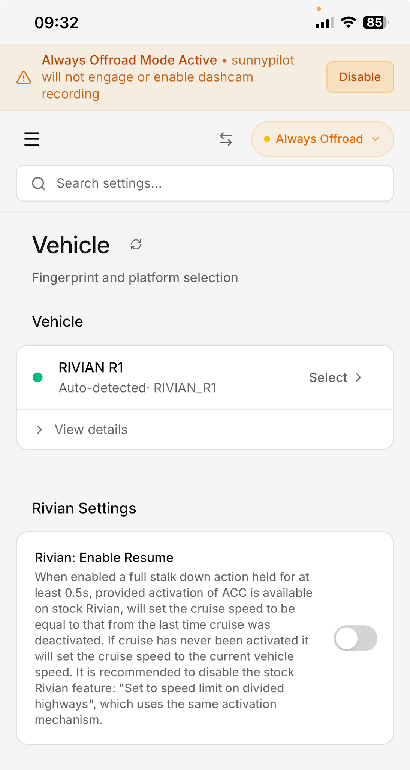

# Rivian Resume

**Applies to:** Rivian R1T / R1S. Rivian-only. Needs the xnor longitudinal harness (xnor.shop) and longitudinal control enabled.

Rivian has no native cruise resume, unlike other brands. With Comma and the xnor longitudinal harness you can get back most of the resume behavior you may be used to elsewhere.

---

## Setting up

- Enable **longitudinal control** (developer menu).
- Turn on **Rivian: Enable Resume** - in the device's **Cruise** menu, or on the **Sunnylink Vehicle** page. It appears only once the comma has fingerprinted a Rivian and is OffRoad, and it defaults to **off**. Resume does nothing until this toggle is enabled.
- Disable the native Rivian **"Set to speed limit on divided highways"** feature (hold the right-hand stalk down for 0.5 s). Do this even if you never use Resume: with comma longitudinal control, that native feature otherwise causes a large - though harmless - mismatch between the comma and Rivian set-speed displays. It also uses the same stalk gesture as Resume.

---

## How it works

Hold the right-hand stalk down fully for at least 0.5 seconds. The cruise set speed is restored to the set speed you were using when cruise was last turned off. If cruise has never been engaged, it is set to the current vehicle speed instead.

As on stock Rivian, this only works where stock Rivian would let you invoke cruise at all: above 20 mph / 32 km/h, or in some stopped situations behind another vehicle (a traffic light, a stop sign).

**One deactivation, one resume.** The remembered speed is cleared as soon as it has been used; only a fresh cruise deactivation stores a new one. So the feature brings back the speed from before cruise dropped out, and after that it has nothing to restore until cruise drops out again.

> Earlier builds kept the old speed instead of clearing it, and would reapply it if you held the stalk down again later in the same drive - overwriting a speed you had chosen since. For example: resume at 70, then drop to 50 for a slower road, then have 70 snap back on the next stalk-hold. That is fixed.

---

## Things to note

- After a resume, the Rivian's own set-speed display will be out of sync with the comma's actual set speed - it shows the speed the car was doing when resume was invoked. This is the same kind of mismatch you get from the steering-wheel speed buttons, just larger.
- If the car was going **slower** than the resumed speed, you can bring the Rivian display back into line: a tap down on the right-hand stalk updates the Rivian's displayed set speed to the current vehicle speed.
- If the car was going **faster** than the resumed speed, that trick does not work - an inherent limitation of the Rivian system.

---

## Where the stale-speed fix landed

| Line | First shipped in |
| :---- | :---- |
| `stg` (general) | `v2026.08.08-56` |
| `stg-a` (angle harness) | `v2026.08.08-57` |

Both lines carry identical code. It is included in every build published since, so a current `stg` / `stg-a` prebuilt is covered if its version is that **or newer**. Also on the `dev` and `dev-a` development trunks.

**Not yet on** `rel`, `rel-src` or `ap-dev`. The Resume toggle itself has been available on those branches for much longer - it is only this stale-speed fix that has not reached them, so on `ap-dev` Resume still shows the old behavior.

**No safety-layer code was touched.** The fix only changes which number the set speed is restored to, inside a feature you have to switch on. It cannot make the car command a speed you never set - if anything the opposite, since the bug it removes was the car reapplying a speed you had deliberately moved away from.
